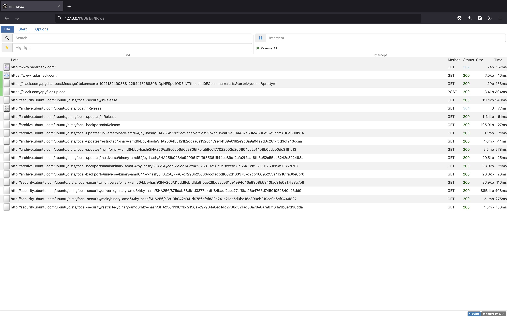

## mitmproxy deployment in kubernetes solving the untrusted certificate problem

### Setup mitmproxy on Kubernetes

```
kubectl create ns mitmproxy
```
```
kubectl apply -f - <<EOF
apiVersion: v1
kind: Pod
metadata:
  name: mitmproxy
  namespace: mitmproxy
  labels:
    proxy: mitmproxy
spec:
  containers:
  - name: mitmweb
    image: mitmproxy/mitmproxy
    command: ["mitmweb"]
    args: ["--web-host","0.0.0.0","--insecure"]
EOF
```
```
kubectl apply -f - <<EOF
apiVersion: v1
kind: Service
metadata:
  name: mitmproxy-svc
  namespace: mitmproxy
spec:
  selector:
    proxy: mitmproxy
  ports:
    - protocol: TCP
      port: 8080
      targetPort: 8080
      name: mitmproxy
    - protocol: TCP
      port: 8081
      targetPort: 8081
      name: mitmweb
EOF
```

### Copy the `mitmproxy-ca.pem` from the `mitmproxy` pod
```
kubectl cp mitmproxy/mitmproxy:/root/.mitmproxy/mitmproxy-ca.pem  ./mitmproxy-ca.pem
```

### Create a secret 
```
kubectl create secret generic mitmproxysecret  --from-file=mitmproxy-ca.pem
```

### Create a port-forward
```
kubectl port-forward  -n mitmproxy svc/mitmproxy-svc  8081:8081
```

### Connect your browser `http://127.0.0.1:8081`


## Creating a demo pod
```
kubectl apply -f - <<EOF
apiVersion: v1
kind: Pod
metadata:
  name: mitm-demo-pod
spec:
  containers:
  - name: mitm-demo
    image: xxradar/hackon
    command:
    - sleep
    args:
    - 5000s
    lifecycle:
      postStart:
        exec:
          command:
          - bash
          - -c
          - cp /certs/mitmproxy-ca.pem /usr/local/share/ca-certificates/mitmproxy-ca.crt ; update-ca-certificates --fresh
    env:
    - name: http_proxy
      value: "http://mitmproxy-svc.mitmproxy:8080/"
    - name: https_proxy
      value: "http://mitmproxy-svc.mitmproxy:8080/"
    volumeMounts:
    - mountPath: /certs
      name: mitmproxysecret
      readOnly: true
  volumes:
  - name: mitmproxysecret
    secret:
      secretName: mitmproxysecret
EOF
```
